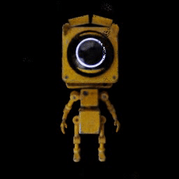

# NeRF and DietNeRF 
## Introduction


<br />
<div align="center">
<h3 align="center">NeRF and DietNeRF implementation and some elaborations</h3>
  <p align="center">
    This project was created as part of a "Tutorial-Work" at the Hebrew University of Jerusalem.
    <br />
    <a href="https://docs.google.com/presentation/d/e/2PACX-1vTn82d6wCRm_8VULagdx73I-NYTele5miHlF1lEguYB2I7Mx1WsvRH6nIQObdv7E2NxfU1aAQ9WW9xl/pub?start=false&loop=false&delayms=3000"><strong>Please explore the presentation for more details »</strong></a>
    <br />
    <br />
    <a href="https://github.com/Sahar-E/NeRF-and-DietNeRF/tree/main/src">View src code</a>
    ·
    <a href="https://arxiv.org/pdf/2003.08934.pdf">NeRF Paper</a>
    ·
    <a href="https://arxiv.org/pdf/2104.00677.pdf">DietNeRF Paper</a>
  </p>
</div>


<!-- TABLE OF CONTENTS -->
<details>
  <summary>Table of Contents</summary>
  <ol>
    <li>
      <a href="#about-the-project">About The Project</a>
      <ul>
        <li><a href="#built-with">Built With</a></li>
      </ul>
    </li>
    <li>
      <a href="#getting-started">Getting Started</a>
      <ul>
        <li><a href="#prerequisites">Prerequisites</a></li>
        <li><a href="#installation">Installation</a></li>
      </ul>
    </li>
    <li><a href="#usage">Usage</a></li>
    <li><a href="#citations">Citations</a></li>
  </ol>
</details>


<!-- ABOUT THE PROJECT -->
## About The Project

This project is my implementation and some elaborations that I did to the papers:
* NeRF: Representing Scenes as Neural Radiance Fields for View Synthesis
* Putting NeRF on a Diet: Semantically Consistent Few-Shot View Synthesis

NeRF presents a method for synthesizing novel views of complex scenes by optimizing an underlying continuous volumetric scene function using a sparse set of input views.
The algorithm represents a scene using a fully connected deep network, whose input is a single continuous 5D coordinate (the spatial location (x, y, z), viewing direction (θ,Φ)) and outputs a is an emitted color (R, G, B) and volume density σ of that radiance.

DietNeRF introduces an auxiliary semantic consistency loss that encourages realistic rendering at novel poses. It improves fine details and the reconstruction of the scene.

In addition to implementing the ideas presented in the papers, I tested the importance of the "Viewing Directions" input to the model, created visualizations in the form of plots and videos, and implemented some methods that helped me in the creation of those visualizations. 
For the calculations of the rotations in the videos, I used quaternions.
For more information, please look at the Powerpoint presentation.


### Built With

The project is implemented in [Python](https://www.python.org/), using the [Tensorflow](https://www.tensorflow.org/) machine learning library.
This project is also [GCP](https://cloud.google.com/) (Google Cloud Platform) ready. For GCP deployment, follow the Usage guidlines below.


<p align="right">(<a href="#top">back to top</a>)</p>

<!-- GETTING STARTED -->
## Getting Started


1. Create a config_file.yaml – Please follow an existing Yaml file for directions.
    1. In the Yaml you specify what actions you want to be done in that execution – Training a net, rendering a video, creating a specific plot with a model and more.
2. Put it in directory called “config_files”.
3. Write in main.py in the list of “config_list” the name of the config file.
4. Add to directory Assets the images and the file that holds the images poses. 
5. Add "camera poses" to the same directory of the images
    1. If the dataset was created with Blender, add the “cam_data.json” file to the same directory (A script that render images and create the json can be found in “DatasetUtils” directory).
    2. If the dataset was created with real images, you can use COLMAP to provide the “poses_bounds.npy” the same way as detailed in LLFF (Local Light Field Fusion) project.

<p align="right">(<a href="#top">back to top</a>)</p>

### Prerequisites

It may be helpful to set your environment with the supplied “Dockerfile” files.
There is a docker for the basic environment, and one that wrap the project into an image ready to be deployed in GCP.

You **can** set up your environment on your own without the docker supplementary files. 

These are the important packages that I used:
* python3
* numpy
* numpy-quaternion
* tensorflow-gpu
* opencv-python
* cloudpathlib[gs]


<p align="right">(<a href="#top">back to top</a>)</p>

### Installation

1. Clone the repo
   ```sh
   git clone https://github.com/Sahar-E/NeRF-and-DietNeRF.git
   ```
2. Use docker as an environment with the supplied Dockerfiles / Setup venv your own venv.


<p align="right">(<a href="#top">back to top</a>)</p>

## Usage

1. Create and add your configuration.yaml file to main.py file where the "TODO" is pointing to. You should fork from an existing one in the project.
2. Run:
    ```sh
      python3 main.py
      ```

### To use real images
If you wish to use real images, you will need to create the poses_bounds.npy in the same way as detailed in LLFF (Local Light Field Fusion) project.
After that, it is the same as using the images with the cam_data.json file created by the blender python script in the project.


### If you wish to use docker as the environment
1. Create an "environment" docker image using the Dockerfile in [contain_dockerfile_for_base_environment](https://github.com/Sahar-E/NeRF-and-DietNeRF/tree/main/contain_dockerfile_for_base_environment) directory.

### If you wish to deploy the docker in the Google Cloud Platform
1. Create an "environment" docker image using the Dockerfile in [contain_dockerfile_for_base_environment](https://github.com/Sahar-E/NeRF-and-DietNeRF/tree/main/contain_dockerfile_for_base_environment) directory.
2. Configure the name in the [Dockerfile](https://github.com/Sahar-E/NeRF-and-DietNeRF/blob/main/Dockerfile) at the root of the project, where the TODO note asks, and create the docker image.
3. Deploy the docker image in GCP.
4. Don't forget to set the Google's "Bucket" in the configuration file so it can sync the results into that bucket. 


### You can use the scipts in the [DatasetUtils](https://github.com/Sahar-E/NeRF-and-DietNeRF/tree/main/DatasetUtils) directory to create the blender pictures, resize the images and create jpgs from mp4 video file:


#### blender_create_pictures.py
In the “DatasetUtils” you can find the script “blender_create_pictures.py” that can be opened in Blender and activated by it.
This script will move the camera in the scene, render the images and write with them their needed metadata with poses data in a file called “cam_data.json”. 
The folders that will be created are ready to go into the project.

#### resize_images.py
Another script in the “DatasetUtils” is “resize_images.py” that resizes the images in a given directory to convenient sizes for testing the project, e.g. 50x50, 100x100, 256x256.

#### video2jpg.py
Also in “DatasetUtils”. Takes a video and break it up to jpg frames.


<p align="right">(<a href="#top">back to top</a>)</p>


## Citations

* NeRF: Representing Scenes as Neural Radiance Fields for View Synthesis. Ben Mildenhall and Pratul P. Srinivasan and Matthew Tancik and Jonathan T. Barron and Ravi Ramamoorthi and Ren Ng. ECCV, 2020. https://arxiv.org/pdf/2003.08934.pdf
* Putting NeRF on a Diet: Semantically Consistent Few-Shot View Synthesis. Ajay Jain, Matthew Tancik, Pieter Abbeel. ICCV, 2021. https://arxiv.org/pdf/2104.00677.pdf
* Local Light Field Fusion: Practical View Synthesis with Prescriptive Sampling Guidelines. Ben Mildenhall and Pratul P. Srinivasan and Rodrigo Ortiz-Cayon and Nima Khademi Kalantari and Ravi Ramamoorthi and Ren Ng and Abhishek Kar. ACM Transactions on Graphics (TOG). 2019. https://arxiv.org/pdf/1905.00889.pdf, https://github.com/Fyusion/LLFF
* COLMAP - Pixelwise View Selection for Unstructured Multi-View Stereo. Schonberger, Johannes Lutz and Zheng, Enliang and Pollefeys, Marc and Frahm, Jan-Michael. ECCV. 2016.


<p align="right">(<a href="#top">back to top</a>)</p>

#  Demo Videos
For more videos, please check out the powerpoint presentation found in the link above (The videos there are 60FPS. I recommend entering "Slide Show" full screen mode. That way the videos will auto start in the presentation). 





<p align="right">(<a href="#top">back to top</a>)</p>
